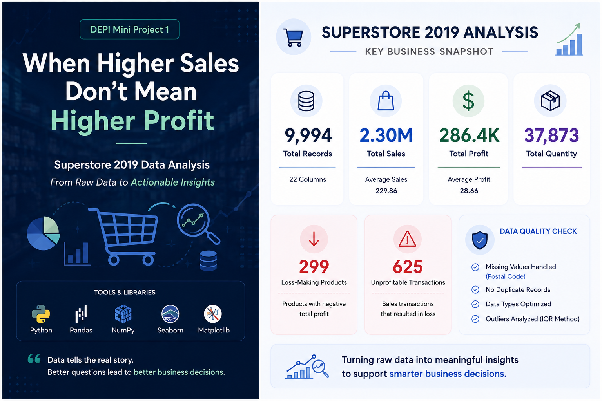

# Superstore-Data-Analysis



## Superstore 2019 — Data Analysis & Automated Reporting

An exploratory data analysis project completed as part of my **DEPI Data Analysis training**.

## Project Overview

This project analyzes the **Sample Superstore 2019** dataset using Python to explore sales, profit, discounts, customer segments, categories, regions, and other business-related metrics.

The project focuses on transforming raw data into meaningful insights through data cleaning, exploratory analysis, feature engineering, visualization, and automated reporting.

## Project Workflow

### 1. Data Inspection & Cleaning

- Inspected the dataset structure, columns, and data types
- Checked for missing values
- Checked for duplicate records
- Cleaned categorical text values
- Handled missing values in the dataset
- Verified data consistency

### 2. Outlier Analysis

Outliers were analyzed using the **IQR (Interquartile Range)** method.

The analysis identified outliers in:

- Sales
- Profit
- Quantity
- Discount

The detected values were reviewed rather than automatically removed, since extreme values can represent valid business transactions.

### 3. Feature Engineering

Created additional features to support the analysis:

- **Profit Margin**
- **Shipping Duration**
- **Sales Performance Category**

These features helped provide additional perspectives on business performance.

### 4. OOP-Based Data Analysis

A reusable **`DataAnalyzer`** class was developed to organize the analysis workflow.

It was used for:

- Data preprocessing
- Feature engineering
- KPI calculations
- Business analysis
- Correlation analysis
- Data visualization
- Report generation
- Exporting processed data

### 5. Exploratory Data Analysis

The project includes visual analysis of:

- Sales distribution
- Profit distribution
- Sales by category
- Profit by category
- Profit by segment
- Category and region profit
- Monthly sales trends
- Sales vs. Profit
- Discount impact on profit

## Key Findings

- **Total Sales:** 2.30M
- **Total Profit:** 286.4K
- **Total Quantity:** 37,873
- **299** products had negative total profit
- **625** transactions resulted in losses
- At **50% discount**, the average profit was approximately **-310.70**
- Discount and Profit Margin showed a strong negative correlation of approximately **-0.86**

One of the main observations from the analysis was that **higher sales do not necessarily mean higher profitability**.

The relationship between discounting and profitability was particularly noticeable, showing how aggressive discounts can negatively affect profit margins.

## Memory Optimization

The DataFrame memory usage was reduced from:

**9.50 MB → 1.99 MB**

This resulted in approximately **79.04% memory reduction**.

## Visualizations

The notebook includes multiple visualizations created using Matplotlib and Seaborn, including:

- Distribution plots
- Bar charts
- Time-series analysis
- Scatter plots
- Heatmaps

These visualizations were used to identify patterns, relationships, and potential business insights.

## Tools & Technologies

- Python
- Pandas
- NumPy
- Matplotlib
- Seaborn
- Jupyter Notebook

## Project Structure

```text
Superstore-Data-Analysis/
│
├── README.md
├── Superstore_Analysis.ipynb
│
└── images/
    └── Cover.png
